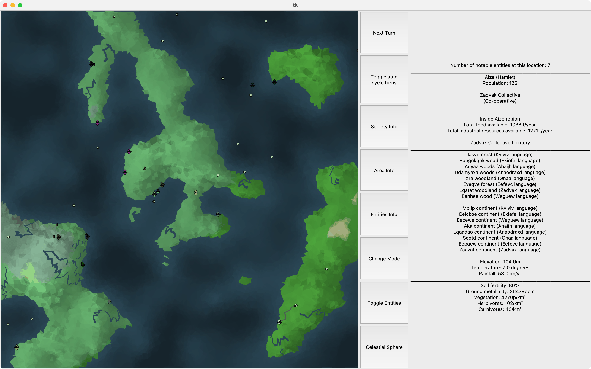
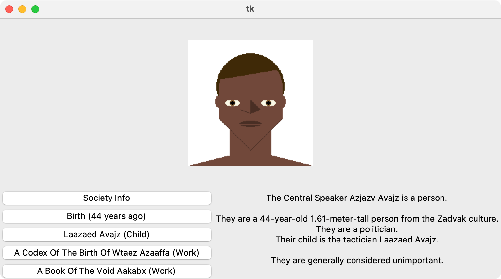

# Python-world-gen
An experimental python worldgen toy.






Either run:

```sh
mkdir -p generated
virtualenv venv -p python3
source venv/bin/activate
pip install numpy Pillow scipy matplotlib
python src_mapgenmain.py
```

or

```sh
mkdir -p generated
uv run --with numpy,Pillow,scipy,matplotlib src_mapgenmain.py
```


On Mac, if you're using Homebrew Python, you will need tk. Run `brew install python-tk`.
